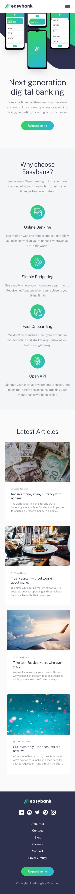
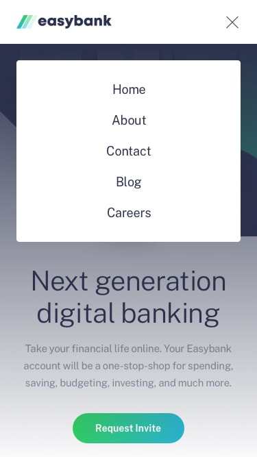

# Frontend Mentor - Easybank landing page solution

This is a solution to the [Easybank landing page challenge on Frontend Mentor](https://www.frontendmentor.io/challenges/easybank-landing-page-WaUhkoDN).

## Table of contents

- [Overview](#overview)
  - [The challenge](#the-challenge)
  - [Screenshot](#screenshot)
  - [Links](#links)
- [My process](#my-process)
  - [Built with](#built-with)
  - [What I learned](#what-i-learned)
  - [Continued development](#continued-development)
  - [Useful resources](#useful-resources)
- [Author](#author)
- [Acknowledgments](#acknowledgments)

## Overview

### The challenge

Users should be able to:

- View the optimal layout for the site depending on their device's screen size
- See hover states for all interactive elements on the page

### Screenshot

#### Active States

#### Desktop Preview

#### Mobile Preview

#### Mobile navigation

### Links

- Live Site URL: [Easy bank landing page](https://easy-bank-afgar.vercel.app/)
- Solution URL: [Frontend Mentor Solution](https://www.frontendmentor.io/solutions/easy-bank-landing-page-na7YFqzR53)

## My process

### Built with

- Semantic HTML5 markup
- CSS custom properties
- Flexbox
- CSS Grid

### What I learned

- **Responsive Design**: Gained experience in making layouts responsive across different screen sizes using media queries and CSS Grid/Flexbox.
- **CSS Custom Properties**: Utilized CSS variables to manage colors and spacing more efficiently.
- **Hover States**: Implemented interactive hover states to improve user experience.

### Continued Development

- **Accessibility**: Plan to focus on enhancing accessibility features, such as ARIA roles and keyboard navigation.
- **Performance Optimization**: Aim to optimize CSS and JavaScript for faster load times and better performance.
- **Advanced CSS**: Explore advanced CSS techniques and features to enhance design and interactivity.

### Useful resources

- [CSS Tricks: Flexbox](https://css-tricks.com/snippets/css/a-guide-to-flexbox/)
- [MDN Web Docs: CSS Grid Layout](https://developer.mozilla.org/en-US/docs/Web/CSS/CSS_Grid_Layout)

## Author

- Name - [Muhammad Ikram](.)
- Frontend Mentor - [@ikramafgar](https://www.frontendmentor.io/profile/ikramafgar)

## Acknowledgments

- A big thanks to the Frontend Mentor community for the challenge and inspiration.
